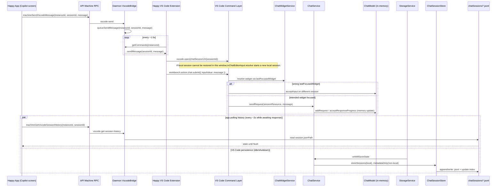

# VS Code Copilot Send Trace (Command -> Model -> Disk)

This traces why a sent message can be visible in VS Code but not immediately visible in Happy's Copilot view.

## 1) Send command path

1. Happy app sends `vscode-send` RPC with `{ instanceId, sessionId, message }`.
2. Daemon queues command in per-instance command queue.
3. VS Code bridge extension polls commands and handles `sendMessage`.
4. Extension opens the session URI and invokes `workbench.action.chat.submit`.
5. VS Code `ChatSubmitAction` resolves target widget from `context.widget ?? widgetService.lastFocusedWidget` and calls `widget.acceptInput(context.inputValue)`.
6. `acceptInput` calls `chatService.sendRequest(...)`, which mutates `ChatModel` in memory (`addRequest`, response progress, etc.).

### Important targeting caveat

`workbench.action.chat.focusInput` also targets `lastFocusedWidget`, not a provided session resource. If focus has not moved to the intended session widget yet, submit can land in a different chat widget/session.

### Important restore caveat

When opening a local session URI, if the session cannot be restored in that window, VS Code creates a new local session for that URI.

## 2) Persistence path (why files lag)

1. Chat persistence is triggered from `storageService.onWillSaveState(() => saveState())`.
2. Storage flush is scheduled when idle with a default interval of 60 seconds.
3. On save:
   - Local chat sessions are written to `chatSessions/*.jsonl|*.json`.
   - Non-local (contributed) sessions are metadata-only in the chat index.
4. Happy daemon conversation history currently reads from `session.jsonPath` on disk.

Result: the daemon/app can poll frequently and still read stale transcript data until VS Code flushes state.

## 3) Sequence diagram

## 4) Source references

### Happy code
- `packages/happy-app/sources/sync/ops.ts` (`machineSendVscodeMessage`, `machineGetVscodeSessionHistory`)
- `packages/happy-app/sources/app/(app)/copilot/[machineId]/[instanceId]/[sessionId].tsx` (send, optimistic UI, 2s history polling)
- `packages/happy-cli/src/api/apiMachine.ts` (`vscode-send`, `vscode-get-session-history` handlers)
- `packages/happy-cli/src/daemon/run.ts` (RPC wiring to bridge)
- `packages/happy-cli/src/daemon/vscodeBridge.ts` (`queueSendMessage`, `getSessionHistory` reads `jsonPath`)
- `packages/happy-vscode-extension/src/extension.ts` (`sendMessageToChat`, `scanAndSendSessions`, command polling)

### VS Code source
- `.tmp/vscode/src/vs/workbench/contrib/chat/browser/actions/chatExecuteActions.ts` (`workbench.action.chat.submit` targets `lastFocusedWidget`)
- `.tmp/vscode/src/vs/workbench/contrib/chat/browser/actions/chatActions.ts` (`workbench.action.chat.focusInput` targets `lastFocusedWidget`)
- `.tmp/vscode/src/vs/workbench/contrib/chat/browser/widgetHosts/editor/chatEditorInput.ts` (fallback to new local session)
- `.tmp/vscode/src/vs/workbench/contrib/chat/browser/widget/chatWidget.ts` (`acceptInput` -> `chatService.sendRequest`)
- `.tmp/vscode/src/vs/workbench/contrib/chat/common/chatService/chatServiceImpl.ts` (in-memory mutation + save hook + local/non-local persistence split)
- `.tmp/vscode/src/vs/platform/storage/common/storage.ts` (idle flush scheduler, 60s default)
- `.tmp/vscode/src/vs/workbench/contrib/chat/common/model/chatSessionStore.ts` (writes `.jsonl/.json` and index)
